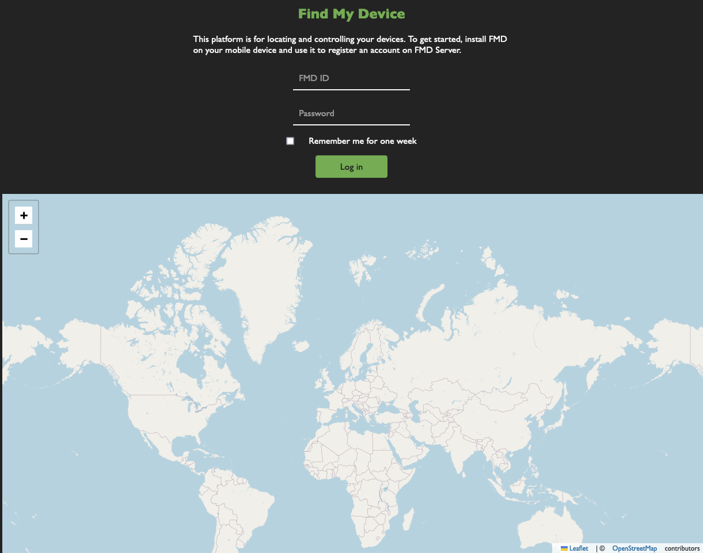

<!--
N.B.: Diese README wurde automatisch von <https://github.com/YunoHost/apps/tree/master/tools/readme_generator> generiert.
Sie darf NICHT von Hand bearbeitet werden.
-->

# Find My Device für YunoHost

[](https://ci-apps.yunohost.org/ci/apps/findmydevice/)


[](https://install-app.yunohost.org/?app=findmydevice)

*[Dieses README in anderen Sprachen lesen.](./ALL_README.md)*

> *Mit diesem Paket können Sie Find My Device schnell und einfach auf einem YunoHost-Server installieren.*  
> *Wenn Sie YunoHost nicht haben, lesen Sie bitte [die Anleitung](https://yunohost.org/install), um zu erfahren, wie Sie es installieren.*

## Übersicht

The FMD app can register an account on FMD Server. The app can then upload its location at regular intervals.
You can also push commands to the FMD app on your device from FMD Server, e.g. to make your device ring.

**Ausgelieferte Version:** 0.10.0~ynh3

## Bildschirmfotos



## Dokumentation und Ressourcen

- Upstream App Repository: <https://gitlab.com/Nulide/findmydeviceserver>
- YunoHost-Shop: <https://apps.yunohost.org/app/findmydevice>
- Einen Fehler melden: <https://github.com/YunoHost-Apps/findmydevice_ynh/issues>

## Entwicklerinformationen

Bitte senden Sie Ihren Pull-Request an den [`testing` branch](https://github.com/YunoHost-Apps/findmydevice_ynh/tree/testing).

Um den `testing` Branch auszuprobieren, gehen Sie bitte wie folgt vor:

```bash
sudo yunohost app install https://github.com/YunoHost-Apps/findmydevice_ynh/tree/testing --debug
oder
sudo yunohost app upgrade findmydevice -u https://github.com/YunoHost-Apps/findmydevice_ynh/tree/testing --debug
```

**Weitere Informationen zur App-Paketierung:** <https://yunohost.org/packaging_apps>
